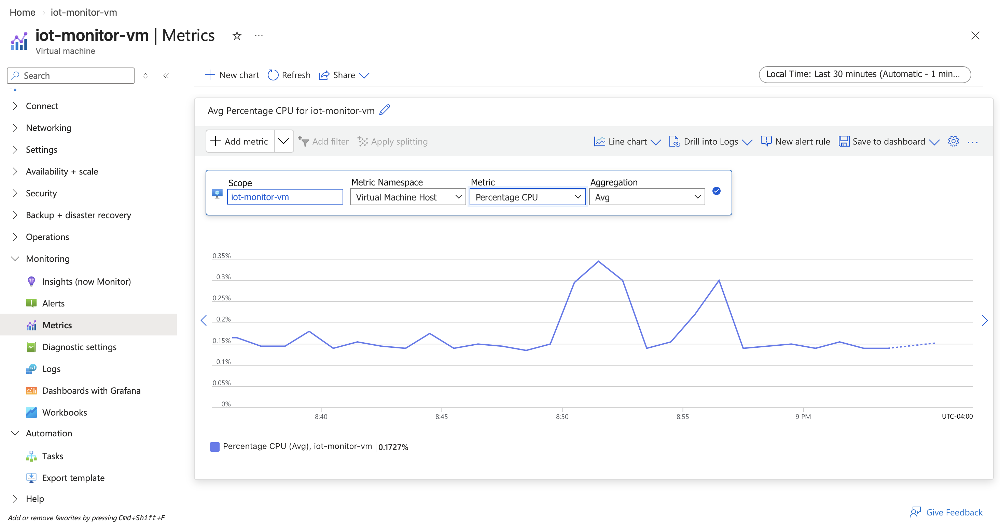
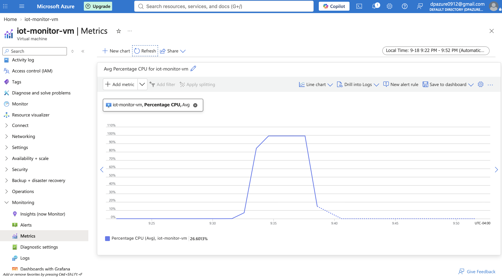
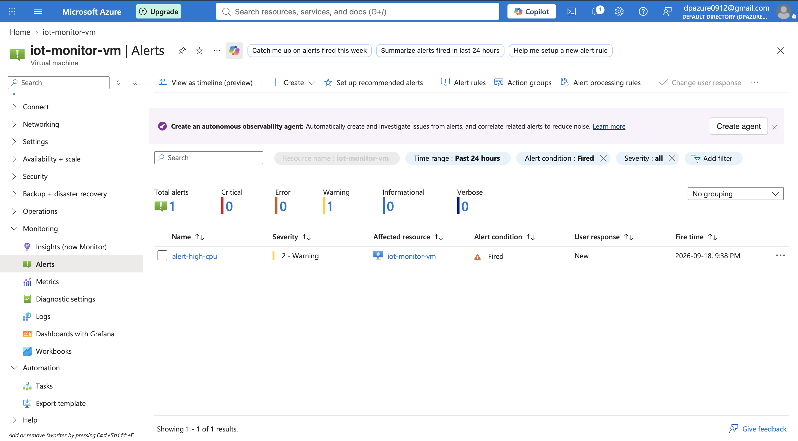
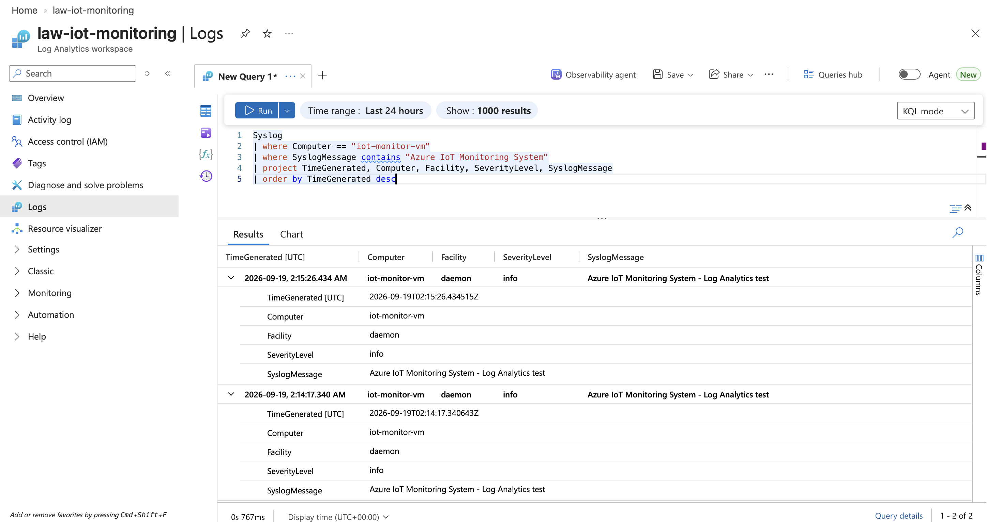

# Azure IoT Monitoring System

A cloud-based IoT monitoring and alerting project built with Microsoft Azure, Python, Linux, Azure Monitor, Log Analytics, Blob Storage, and KQL.

The project simulates IoT sensor telemetry on an Azure-hosted Linux virtual machine and demonstrates cloud infrastructure deployment, monitoring, centralized Linux logging, alerting, storage, security, governance, and cost-management practices.

> **Version 1.0.0** — Azure infrastructure, telemetry simulation, monitoring, logging, alerting, storage, security, and cost governance.

---

## Project Overview

The Azure IoT Monitoring System was developed as a hands-on cloud engineering project to demonstrate practical Microsoft Azure fundamentals.

A Python telemetry simulator generates synthetic sensor readings for:

- Light level
- Sound level
- Distance
- Device status
- Alert conditions

The simulator runs on an Ubuntu Linux virtual machine in Azure and is managed as a persistent `systemd` service.

Azure services are used to provide infrastructure monitoring, Linux log collection, KQL analysis, alerting, telemetry archival, networking, security, access control, and cost governance.

---

## Architecture


### Data and Monitoring Flow

**Application telemetry**

```text
Python Telemetry Simulator
        ↓
telemetry.log
```

**Linux monitoring**

```text
Azure Linux VM
        ↓
Azure Monitor Agent
        ↓
Data Collection Rule
        ↓
Log Analytics Workspace
        ↓
KQL
```

**Infrastructure alerting**

```text
VM Metrics
    ↓
Azure Monitor
    ↓
CPU Alert Rule
    ↓
Action Group
    ↓
Email Notification
```

**Telemetry archival**

```text
Telemetry Sample
      ↓
Azure Blob Storage
      ↓
telemetry-archive
```

---

## Azure Services

| Service | Purpose |
|---|---|
| Azure Virtual Machines | Hosts the Linux telemetry simulator |
| Azure Virtual Network | Provides network isolation and connectivity |
| Network Security Group | Controls inbound network access |
| Azure Monitor | Monitors VM metrics and alert conditions |
| Azure Monitor Agent | Collects supported guest operating-system data |
| Data Collection Rule | Defines Linux Syslog collection |
| Log Analytics Workspace | Centralizes collected Linux logs |
| Azure Blob Storage | Stores archived sample telemetry |
| Azure RBAC | Controls access to Azure resources |
| Azure Cost Management | Tracks project cloud consumption and budget thresholds |

---

## Telemetry Simulator

The Python simulator generates synthetic IoT sensor readings at regular intervals.

Example:

```json
{
  "timestamp": "2026-09-19T14:00:00+00:00",
  "device_id": "simulated-iot-device-01",
  "light_percent": 72.4,
  "sound_db": 58.1,
  "distance_cm": 94.6,
  "status": "NORMAL",
  "alerts": []
}
```

The simulator evaluates sensor values and generates application-level alert states including:

- `HIGH_LIGHT`
- `HIGH_SOUND`
- `OBJECT_TOO_CLOSE`

The generated records are written locally to `telemetry.log`.

Runtime log files are excluded from Git.

---

## Linux Deployment

The application is deployed on an Ubuntu Linux Azure VM.

The environment includes:

- Python 3
- Python virtual environment
- Git
- systemd
- Azure Monitor Agent

The telemetry simulator runs as a `systemd` service so that it can automatically start when the VM boots.

Deployment documentation:

[`docs/linux-deployment.md`](docs/linux-deployment.md)

---

## Monitoring and Alerting

Azure Monitor is used to observe infrastructure metrics for the Linux VM.

A CPU alert rule was configured to trigger when CPU utilization exceeds the configured threshold.

The alert workflow is:

```text
Azure VM
   ↓
Percentage CPU
   ↓
Azure Monitor Alert
   ↓
Action Group
   ↓
Email Notification
```

The alert was tested by generating CPU load on the VM and verifying the alert activation.

### Monitoring Evidence







---

## Log Analytics and KQL

Azure Monitor Agent and a Data Collection Rule collect selected Linux Syslog facilities from the VM.

Collected operating-system logs are delivered to the Log Analytics workspace:

```text
law-iot-monitoring
```

KQL is used to analyze the collected logs.

Example:

```kusto
Syslog
| where Computer contains "iot-monitor-vm"
| project TimeGenerated, Computer, Facility, SeverityLevel, SyslogMessage
| order by TimeGenerated desc
| take 50
```

KQL queries are stored under:

```text
queries/
```

### Log Analytics Evidence



> The current v1 Log Analytics pipeline collects Linux Syslog. The simulator's `telemetry.log` is maintained separately and is not represented as being ingested into Log Analytics.

---

## Azure Blob Storage

Azure Blob Storage is used to demonstrate cloud-based telemetry archival.

A private Blob container named:

```text
telemetry-archive
```

stores a sample telemetry dataset.

A sanitized telemetry example is also included in:

```text
samples/telemetry-sample.jsonl
```

Storage implementation documentation:

[`docs/blob-storage.md`](docs/blob-storage.md)

---

## Security

The project implements several cloud security practices:

- SSH public-key authentication
- Network Security Group filtering
- Restricted SSH source access
- Private Blob Storage container
- Azure RBAC
- Storage Blob Data Contributor role
- No credentials stored in source control
- Sensitive files excluded using `.gitignore`

Security documentation:

[`docs/security.md`](docs/security.md)

Secrets, private keys, environment files, runtime logs, and OS metadata are intentionally excluded from the repository.

---

## Cost Management

The environment is designed as a small development workload.

Cost-management practices include:

- Small B-series development VM
- VM deallocation when not required
- Automatic VM shutdown
- Limited log ingestion
- No unnecessary load balancer
- No unnecessary application gateway
- Resource tagging
- Azure Cost Management budget
- Budget threshold notifications

Cost documentation:

[`docs/cost-management.md`](docs/cost-management.md)

---

## Repository Structure

```text
Azure-IoT-Moinitoring-System/
│
├── README.md
├── requirements.txt
├── .gitignore
│
├── src/
│   └── telemetry_simulator.py
│
├── scripts/
│   └── setup.sh
│
├── queries/
│   └── vm-syslog.kql
│
├── samples/
│   └── telemetry-sample.jsonl
│
├── docs/
│   ├── architecture.png
│   ├── linux-deployment.md
│   ├── blob-storage.md
│   ├── security.md
│   ├── cost-management.md
│   └── ...
│
├── config/
└── tests/
```

---

## Skills Demonstrated

### Microsoft Azure

- Azure Virtual Machines
- Azure Virtual Network
- Network Security Groups
- Azure Monitor
- Azure Monitor Agent
- Data Collection Rules
- Log Analytics
- KQL
- Azure Blob Storage
- Azure RBAC
- Azure Cost Management
- Azure resource tagging

### Linux

- Ubuntu Server
- SSH
- systemd
- Linux package management
- Service management
- Syslog

### Development

- Python
- JSON
- Git
- GitHub

### Cloud Engineering

- Infrastructure monitoring
- Centralized logging
- Alerting
- Cloud storage
- Network security
- Identity and access management
- Cost governance
- Technical documentation

---

## Future Improvements

Version 1 focuses on Azure infrastructure, monitoring, logging, storage, security, and cost governance.

Potential future versions may add:

- Azure IoT Hub
- MQTT/TLS device-to-cloud communication
- Managed Identity
- Automated telemetry archival
- Docker containerization
- GitHub Actions CI/CD
- Terraform or Bicep Infrastructure as Code
- Azure dashboards
- Expanded application telemetry analytics

---

## Project Status

**Version:** 1.0.0  
**Status:** Completed — v1

Further cloud-native IoT and DevOps capabilities are planned as future enhancements.

---

## Author

**Dhruvin Patel**

Software Engineering — IoT  
Ontario Tech University
