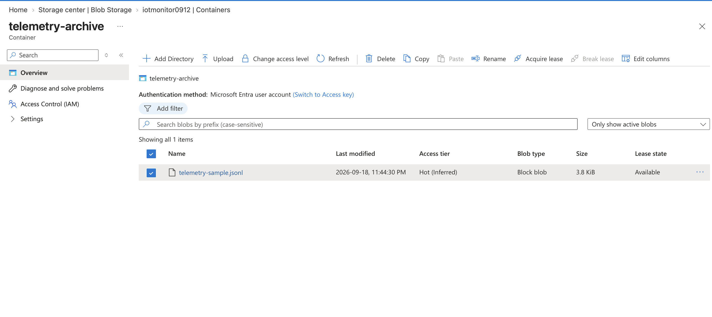

# Azure Blob Storage Telemetry Archive

## Overview

Azure Blob Storage provides the telemetry archive layer for the Azure IoT Monitoring System.

Telemetry generated by the Python IoT simulator can be archived as JSON Lines (`.jsonl`) files in Azure Blob Storage for durable cloud storage.

## Storage Configuration

The Azure Storage account is configured with:

- Performance: Standard
- Redundancy: Locally Redundant Storage (LRS)
- Access tier: Hot
- Secure transfer required
- Minimum TLS version: 1.2
- Anonymous container access disabled
- Microsoft-managed encryption keys

## Telemetry Archive

A private Blob container named `telemetry-archive` stores archived telemetry.

A representative telemetry file generated by the simulator was uploaded as:

`telemetry-sample.jsonl`

Each line contains an individual simulated IoT telemetry event containing:

- Timestamp
- Device ID
- Light percentage
- Sound level
- Distance
- Device status
- Generated alerts

## Authentication and Security

The Blob container does not permit anonymous public access.

Microsoft Entra ID and Azure RBAC are used to authorize access to Blob data rather than exposing storage credentials.

No storage account keys, SAS tokens, connection strings, or other secrets are stored in this repository.

## Architecture

Python IoT Simulator  
↓  
Telemetry JSONL Archive  
↓  
Azure Blob Storage  
↓  
Private `telemetry-archive` Container

## Evidence

